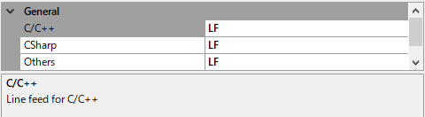

# Visual Studio Extension - ForceLineFeedCode
This extension converts any line feed codes to a specified code before saving a document. You can select that line feed code on the option page.

# Usage  
You can find properties for this at the menu [Tools]->[Options]->[ForceLineFeedCode].  
And, select target codes for each languages (now support for C/C++, CSharp, and others).



- Line Feed code for each languages
    - Now supports, C/C++, C#, or others
- Load setting file
    - Load a setting file, just the name "_forcelinefeedcode.xml". Search a setting file from the directory which includes the focused file up to a directory which includes ".git" or ".svn".

# Setting File
Try to find a setting file,
1. From the directory of the focused file
2. Search **_forcelinefeedcode.xml**
3. If the current directory don't have ".git" or ".svn", move to upper directory and repeat from 2.

An example setting file "_forcelinefeedcode.xml" is below,

```
<?xml version="1.0" encoding="utf-8"?>
<General>
    <Code lang="C/C++">LF</Code>
    <Code lang="CSharp">LF</Code>
    <Code lang="Others">LF</Code>
</General>
```

# License
Public domain

# Release History
v1.9  
Fix don't parse the first entry of a setting file.  
Change to search a setting file from the directory of the focused file.  
v1.8  
Add a option to load a setting file.  
v1.7  
Up .Net Framework to 4.7.2    
Fix using deprecated APIs.  
v1.3  
Rebuild with VS 2019 to fix a error about deprecation.  
v1.2  
Fix referenced COM components and prerequisites.  
v1.1  
Add other languages option  
v1.0  
Initial release.
