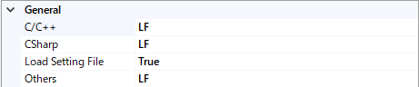

# Visual Studio Extension - ForceLineFeedCode
This extension converts any line feed codes to a specified code before saving a document. You can select that line feed code on the option page.

# Usage  
You can find properties for this at the menu [Tools]->[Options]->[ForceLineFeedCode].  
And, select target codes for each languages (now support for C/C++, CSharp, and others).

- Line Feed code for each languages
    - Now supports, C/C++, C#, or others
- Load setting file
    - Load a setting file just in the solution directory

# Setting File

# License
Public domain

# Release History
v1.4  
Add a option to load a config file in the solution directory.  
v1.3  
Rebuild with VS 2019 to fix a error about deprecation.  
v1.2  
Fix referenced COM components and prerequisites.  
v1.1  
Add other languages option  
v1.0  
Initial release.
